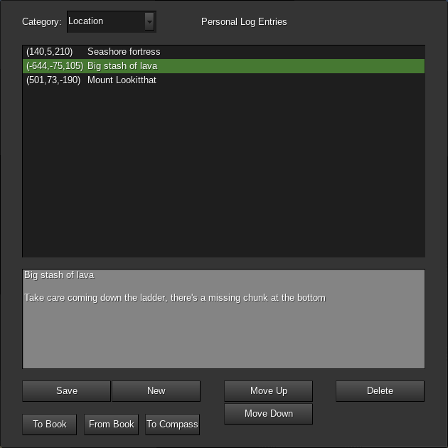

# Personal Logs

This mod adds a "Personal Logs" feature to the Unified Inventory or the SFInv Minetest interfaces.

Personal logs are private notes that you can keep privately for yourself, with the ability to export or import them to and from the default mod's "book" items. This allows you to share your notes with others, too.

Logs can be entered into three different categories:

- Locations
- Events
- General

Location logs will automatically have the player's coordinates saved with them when they're created. If the [ccompass](https://github.com/minetest-mods/ccompass) mod is installed there will be an interface that allows you to set a compass to track the location of one of these entries.

Event logs automatically have the current date saved with them when they're created.

General logs have a free-form text field for their topic, you can use these to record any other sort of general information you desire.

There's no limit to how many logs you can write.